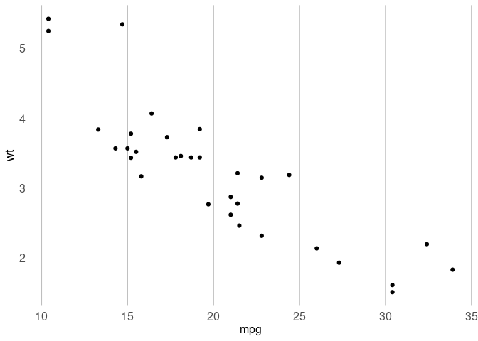

<!-- README.md is generated from README.Rmd. Please edit that file -->

# phsstyles

<!-- badges: start -->

[](https://github.com/Public-Health-Scotland/phsstyles/tags)
<!-- badges: end -->

There are 8 colours for use in [Public Health Scotland
(PHS)](https://www.publichealthscotland.scot/):

- 4 main colours (PHS purple, PHS magenta, PHS blue and PHS green)
- 4 supporting colours (PHS graphite, PHS teal, PHS liberty and PHS
  rust)
- Within each colour there are 5 gradients (e.g. for PHS purple, it
  contains 100%, 80%, 50%, 30% and 10%)

Those 8 colours are shown below:

<figure>

<figcaption aria-hidden="true">All eight colours for use in Public
Health Scotland</figcaption>
</figure>

Each colour with their gradients are shown below:

 

Please see [Chart and Dashboard Accessibility
Guidance](http://spark.publichealthscotland.org/media/2176/chart-and-dashboard-accessibility-guidance-version-12.pdf)
for more information.

`phsstyles` contains functions for creating graphics with standard
styles in PHS:

- `phs_colours()` returns hex value for specific named colours
- `theme_phs()` apply pre-defined PHS theme for charts
- `scale_colour_discrete_phs()` apply discrete PHS colour scales for
  charts
- `scale_colour_continuous_phs()` apply continuous PHS colour scales for
  charts
- `scale_fill_discrete_phs()` apply discrete PHS colour filling scales
  for charts
- `scale_fill_continuous_phs()` apply continuous PHS colour filling
  scales for charts

`phsstyles` can be used on both the
[server](https://rstudio.nhsnss.scot.nhs.uk/) and desktop versions of
RStudio.

## Installation

To install `phsstyles`, the package `remotes` is required, and can be
installed with `install.packages("remotes")`.

You can then install `phsstyles` on RStudio server from GitHub with:

``` r
remotes::install_github("Public-Health-Scotland/phsstyles",
  upgrade = "never"
)
```

Network security settings may prevent `remotes::install_github()` from
working on RStudio desktop. If this is the case, `phsstyles` can be
installed by downloading the [zip of the
repository](https://github.com/Public-Health-Scotland/phsstyles/archive/master.zip)
and running the following code (replacing the section marked `<>`,
including the arrows themselves):

``` r
remotes::install_local("<FILEPATH OF ZIPPED FILE>/phsstyles-master.zip",
  upgrade = "never"
)
```

## Using phsstyles

Load `phsstyles` using `library()`:

``` r
library(phsstyles)
```

To access the help file for any of `phsstyles`’ functions, type
`?function_name` into the RStudio console after loading the package:

``` r
?phs_colours
```

### phs_colours

``` r
# Generate hex code for those colours
phs_colours(c("phs-blue", "phs-purple"))
#> [1] "#0078D4" "#3F3685"

# List hex code for all the available colours
phs_colours()
#>      phs-purple     phs-magenta        phs-blue       phs-green    phs-graphite 
#>       "#3F3685"       "#9B4393"       "#0078D4"       "#83BB26"       "#948DA3" 
#>        phs-teal     phs-liberty        phs-rust   phs-purple-80   phs-purple-50 
#>       "#1E7F84"       "#6B5C85"       "#C73918"       "#655E9D"       "#9F9BC2" 
#>   phs-purple-30   phs-purple-10  phs-magenta-80  phs-magenta-50  phs-magenta-30 
#>       "#C5C3DA"       "#ECEBF3"       "#AF69A9"       "#CDA1C9"       "#E1C7DF" 
#>  phs-magenta-10     phs-blue-80     phs-blue-50     phs-blue-30     phs-blue-10 
#>       "#F5ECF4"       "#3393DD"       "#80BCEA"       "#B3D7F2"       "#E6F2FB" 
#>    phs-green-80    phs-green-50    phs-green-30    phs-green-10 phs-graphite-80 
#>       "#9CC951"       "#C1DD93"       "#DAEBBE"       "#F3F8E9"       "#A9A4B5" 
#> phs-graphite-50 phs-graphite-30 phs-graphite-10     phs-teal-80     phs-teal-50 
#>       "#CAC6D1"       "#DFDDE3"       "#F4F4F6"       "#4B999D"       "#8FBFC2" 
#>     phs-teal-30     phs-teal-10  phs-liberty-80  phs-liberty-50  phs-liberty-30 
#>       "#BCD9DA"       "#E9F2F3"       "#897D9D"       "#B5AEC2"       "#D3CEDA" 
#>  phs-liberty-10     phs-rust-80     phs-rust-50     phs-rust-30     phs-rust-10 
#>       "#F0EFF3"       "#D26146"       "#E39C8C"       "#EEC4BA"       "#F9EBE8"

# Create a ggplot chart using this function
library(ggplot2)
phs_bar_chart <- ggplot(mtcars, aes(x = as.factor(cyl), fill = as.factor(cyl))) +  
  geom_bar() +
  scale_fill_manual(values = phs_colours(c("phs-purple", "phs-magenta", "phs-blue"))) +
  theme(legend.position = "none")

phs_bar_chart
```

<!-- -->

### theme_phs

``` r
library(ggplot2)
# Apply PHS theme to a chart
qplot(mpg, wt, data = mtcars) + theme_phs()
#> Warning: `qplot()` was deprecated in ggplot2 3.4.0.
#> This warning is displayed once every 8 hours.
#> Call `lifecycle::last_lifecycle_warnings()` to see where this warning was
#> generated.
```

<!-- -->

``` r

# Overwirte a feature (e.g. remove vertical gridlines and add horizontal ones)
qplot(mpg, wt, data = mtcars) + theme_phs() +
  theme(panel.grid.major.x = element_blank(), 
        panel.grid.major.y = element_line(colour = 
                                            grDevices::rgb(190 / 255, 
                                                           190 / 255, 
                                                           190 / 255)))
```

<!-- -->

### scale_colour_discrete_phs

``` r
# Create a scatter plot using PHS main colour palette
library(ggplot2)
df <- mtcars
df[,'cyl'] <- as.factor(df[,'cyl'])
qplot(mpg, wt, data = df, colour = cyl) + 
  scale_colour_discrete_phs(palette = "main")
```

<!-- -->

### scale_fill_discrete_phs

``` r
# Create a bar chart filled with colours from PHS main-blues palette
library(ggplot2)
ggplot(mtcars, aes(x = as.factor(cyl), fill = as.factor(cyl))) + 
  geom_bar() + 
  scale_fill_discrete_phs(palette = "main-blues") + 
  theme(legend.position = "none")
```

<!-- -->

### scale_colour_continuous_phs

``` r
# Create a scatter plot using continuous colours from PHS main-purples palette
library(ggplot2)
qplot(mpg, wt, data = mtcars, colour = cyl) + 
  scale_colour_continuous_phs(palette = "main-purples") + 
  theme_phs()
```

<!-- -->

### scale_fill_continuous_phs

``` r
# Create a raster chart filled with reversed continuous colours from PHS
# main-purples palette
library(ggplot2)
ggplot(faithfuld, aes(waiting, eruptions)) + 
  geom_raster(aes(fill = density)) + 
  scale_fill_continuous_phs(palette = "main-purples", direction = -1)
```

<!-- -->

## Contributing to phsstyles

At present, the maintainer of this package is [Tina
Fu](https://github.com/Tina815).

This package is intended to be in continuous development and
contributions may be made by anyone within PHS. If you would like to
make a contribution, please first create an
[issue](https://github.com/Public-Health-Scotland/phsstyles/issues) on
GitHub and assign **all** of the package maintainers to it. This is to
ensure that no duplication of effort occurs in the case of multiple
people having the same idea. The package maintainers will discuss the
issue and get back to you as soon as possible.

While the most obvious and eyecatching (as well as intimidating) way of
contributing is by writing a function, this isn’t the only way to make a
useful contribution. Fixing typos in documentation, for example, isn’t
the most glamorous way to contribute, but is of great help to the
package maintainers. Please see this [blogpost by Jim
Hester](https://www.tidyverse.org/blog/2017/08/contributing/) for more
information on getting started with contributing to open source
software.

When contributing, please create a
[branch](https://github.com/Public-Health-Scotland/phsstyles/branches)
in this repository and carry out all work on it. Please ensure you have
linked RStudio to your GitHub account using `usethis::edit_git_config()`
prior to making your contribution. When you are ready for a review,
please create a [pull
request](https://github.com/Public-Health-Scotland/phsstyles/pulls) and
assign **all** of the package maintainers as reviewers. One or all of
them will conduct a review, provide feedback and, if necessary, request
changes prior to merging your branch.

Please be mindful of information governance when contributing to this
package. No data files (aside from publicly available and downloadable
datasets or unless explicitly approved), server connection details,
passwords or person identifiable or otherwise confidential information
should be included anywhere within this package or any other repository
(whether public or private) used within PHS. This includes within code
and code commentary. For more information on security when using git and
GitHub, and on using git and GitHub for version control more generally,
please see the [Transforming Publishing
Programme](https://www.isdscotland.org/Products-and-Services/Transforming-Publishing-Programme/)’s
[Git guide](https://Public-Health-Scotland.github.io/git-guide/) and
[GitHub
guidance](https://github.com/Public-Health-Scotland/GitHub-guidance).

Please feel free to add yourself to the ‘Authors’ section of the
`Description` file when contributing. As a rule of thumb, please assign
your role as author (`"aut"`) when writing an exported function, and as
contributor (`"ctb"`) for anything else.

`phsstyles` will, as much as possible, adhere to the [tidyverse style
guide](https://style.tidyverse.org/) and the [rOpenSci package
development guide](https://devguide.ropensci.org/). The most pertinent
points to take from these are:

- All function names should be in lower case, with words separated by an
  underscore
- Put a space after a comma, never before
- Put a space before and after infix operators such as `<-`, `==` and
  `+`
- Limit code to 80 characters per line
- Function documentation should be generated using
  [`roxygen2`](https://github.com/r-lib/roxygen2)
- Functions should be tested using
  [`testthat`](https://github.com/r-lib/testthat) where possible
- The package should always pass `devtools::check()`

It’s not necessary to have experience with GitHub or of building an R
package to contribute to `phsstyles`. If you wish to contribute code
then, as long as you can write an R function, the package maintainers
can assist with error handling, writing documentation, testing and other
aspects of package development. It is advised, however, to consult
[Hadley Wickham’s R Packages book](https://r-pkgs.org/) prior to making
a contribution. It may also be useful to consult the
[documentation](https://github.com/Public-Health-Scotland/phsstyles/tree/master/R)
and
[tests](https://github.com/Public-Health-Scotland/phsstyles/tree/master/tests/testthat)
of existing functions within this package as a point of reference.

Please note that this README may fail to ‘Knit’ at times as a result of
network security settings. This will likely be due to the badges for the
package’s release version, continuous integration status and test
coverage at the top of the document. If you are editing the `README.Rmd`
document and are unable to successfully get it to ‘Knit’, please contact
the package maintainers for assistance.
